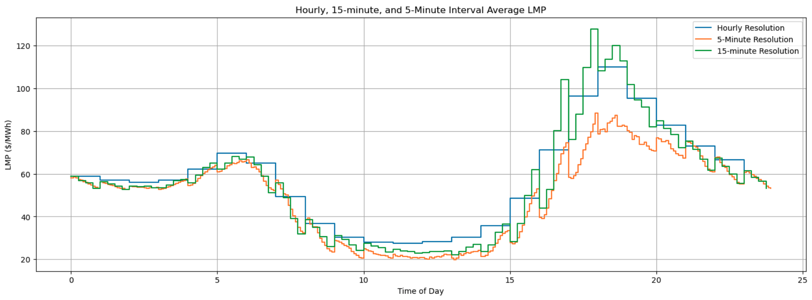
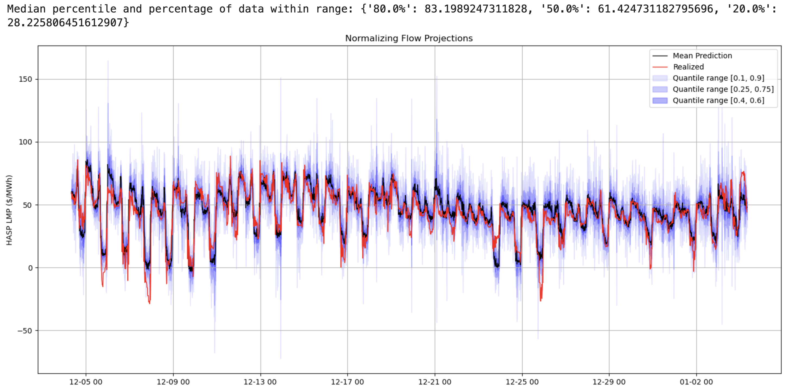

We attempt to use Real NVP to model the distribution of the differences between the hour-ahead and day-ahead predictions of electricity prices (more precisely, LMPs), conditioned upon various input features, following Cramer, et. al [1]. 

The idea is that there are clear trends in the difference between the hour-ahead and day-ahead predictions, generally dependent on the first and second order finite differences of the day-ahead predictions,

and so we would like to model the probability distribution of the price difference vector using a (conditional) normalizing flow algorithm. We use the RealNVP Bijector class defined in TensorFlow to do this. 

Our data is primarily collected from CAISO's OASIS (an online API for the California electricity market), and the code that retrieves the relevant data is contained in the notebook. We also gather temperature data using Iowa State University's Mesonet and German market data, to compare our results with that of [1], from https://energy-charts.info. 

We find that our results are subpar compared to those of [1], likely because of our lack of understanding of the ideal Real NVP architecture for time-series data. This was to be expected, seeing as how this is our first foray into ML. 

[1] E. Cramer, D. Witthaut, A. Mitsos, M. Dahmen, "Multivariate probabilistic forecasting of intraday electricity prices using normalizing flows", Applied Energy, Vol. 346 (2023), Article 121370. 
